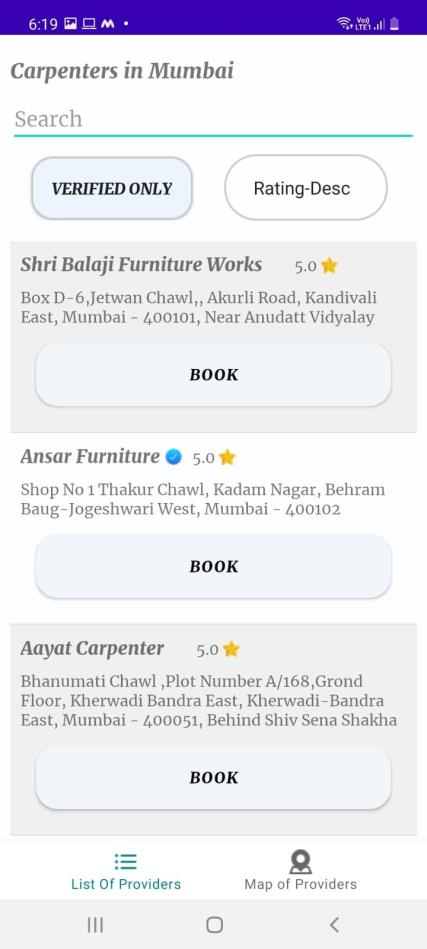

# Ghar Seva

When someone need aid with small but major household tasks, the trouble arises when service
skilled persons are unavailable or the trusted providers are impossible to find, who delivers
consistently flawless service on instance. Our Android application for household services
provides the most expedient and annoys free way to get your domestic work done. We aim to
help in providing optimal solutions to all your household troubles with more efficiency, ease and
majorly, a delicate touch.
Several aspects like Electricians, Carpenters, Home Painting, Pest Control, Sanitization, AC
Repair, Salon, Electronic Goods Repairing and Spa are involved in a system to provide happy
and healthy home atmosphere and customer satisfaction.
The primary objective of the online system for household services is about delivering the home
services at the door step just by one click. Ghar Seva can be used by any authorized user
intending to seek for household services through an android application.
The user can view the list of providers by their location and apply various Spatial and Non-
Spatial filters in order to obtain service from their chosen provider.
The app allows the user to view their past Bookings as well.
Recommendations are also provided to the user based on the services which are usually chosen
by the users next.!

## Documentation

Please find detailed Project report [here](https://drive.google.com/file/d/16szZGUdFbQp0Sbbld1QNmdZGHC-xXN3R/view?usp=sharing).

## Screenshots and Features

  
 
 
 
 

## Tech Stack

**Client:** Andoid, Java, XML

**Server:** Spring Boot

**Database:** PostgreSQL, Neo4j

**Others:** PostGIS, Beautiful Soup

## Badges

